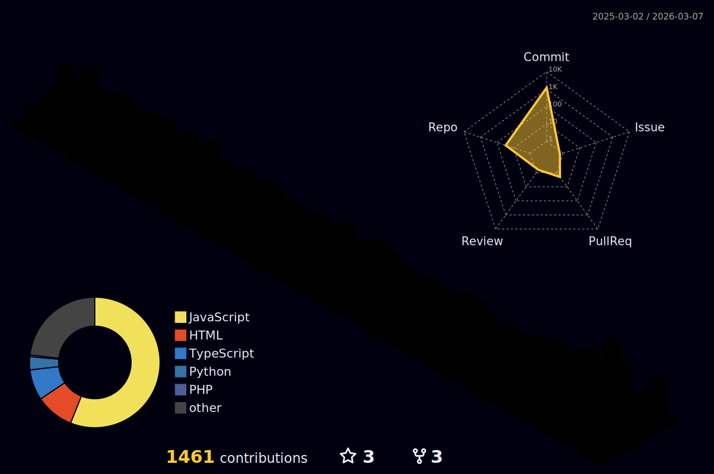

<h1 align="center">
  
   
   
  
   
</h1>

  
</h1>

<h3 align="center">🚀 Full Stack Developer | AI & ML Enthusiast</h3>

  

# 💫 About Me:
Hi, my name is Bikram Manna. I am a full-stack developer with a strong passion for AI, Machine Learning, Deep Learning, Data Science, Computer Vision, and Healthcare AI–related work, where I can contribute my skills while learning from others. I enjoy teamwork, knowledge sharing, and building meaningful solutions through collaboration.  I am currently looking for guidance and support in areas such as model optimization, machine learning deployment using Flask and REST APIs, scaling models for production environments, and exploring advanced deep learning architectures to improve efficiency and performance.  At present, I am actively learning advanced machine learning and deep learning concepts, along with full-stack ML deployment techniques. I am also strengthening my fundamentals in Data Structures and Algorithms, Database Management Systems, Operating Systems, and Computer Networks to build a strong technical foundation.  You can ask me about Python, Machine Learning, Deep Learning, Computer Vision with OpenCV, Healthcare AI concepts, and building ML-powered web applications using Flask.

  

<h1 align="center">👉🏻🅑🅘🅚🅡🅐🅜's Portfolio👈🏻</h1>

  

<h1 align="center">👆🏻</h1>

## 🌐 Socials:

---

## 💻 Tech Stack:

| **Category** | **Technologies / Tools** |
|--------------|-------------------------|
| **LANGUAGES** |         |
| **HOSTING / SAAS** |     |
| **FRAMEWORKS / LIBRARIES** |           |
| **SERVERS** |  |
| **DATABASES / ORM** |    |
| **IDE & ENVIRONMENT** |     |
| **DESIGN** |    |
| **ML / DL** |    |
| **CI/CD / VCS** |     |
| **TESTING** |    |
| **OTHER** |   |

## 💼 My Top 5 Projects:

Here are some of my key projects showcasing my skills in Full-Stack Development, AI/ML, and Computer Vision:

### [Left Ventricular Hypertrophy Detection](https://github.com/bikram73/Left_Ventricular_Hypertrophy_Detection) 🫀  
A **multimodal ML system** for detecting Left Ventricular Hypertrophy (LVH) using ECG, MRI, and CT data.

### [Brahmilipi to Kannada Translator](https://github.com/bikram73/Brahmilipi_to_Kannada_Translator) 📜  
An AI-powered system for recognizing Brahmilipi script characters from images and converting them into Kannada text.

### [OTP Generator (TOTP/HOTP/Challenge Response OTP)](https://github.com/bikram73/OTP-Generator-TOTP-HOTP-ChallengeResponse_OTP-) 🔐  
A professional **multi-factor authentication system** built with **Next.js 15, TypeScript, Tailwind CSS** implementing standard OTP protocols.

### [Face Recognition Attendance System](https://github.com/bikram73/Face_Recognition_Attendance_System) 📱  
An automated attendance system using **Python, OpenCV, and ML**, identifying individuals via live webcam feed.

### [Real-Time Vehicle Sensor Management System](https://github.com/bikram73/Real-Time_Vehicle_Sensor_Management_System) 🚗
An **RTOS-based simulation project** demonstrating interrupt-driven architectures and priority-based task scheduling for vehicle sensor management.

## 🚧 Currently Building:
- 🔥 Scalable Full-Stack Web Applications  
- 🤖 AI & ML–powered real-world systems  
- ☁️ Cloud-deployed projects using AWS & Vercel  
- 🧠 Improving system design & backend performance  

---

## 🎯 My Developer Mission:
> I build intelligent, scalable, and user-focused software solutions that solve real-world problems through clean code and continuous learning.

---

## 🧠 What I Focus On:
✔ Writing clean & maintainable code  
✔ Building production-ready applications  
✔ Applying AI/ML to practical use cases  
✔ Continuous learning & optimization  

## 📈 Contribution Activity:

---
# 📊 GitHub Stats:
 
 

### 🔝 Top Contributed Repo:

---
### 🏆 GitHub Trophies:

---

### 🎯 Profile Views Counter:

## 🐍 Contribution Snake

---

### 📊 GitHub Profile Summary Cards:

## 🧬 3D Contribution Graph

## 📊 GitHub Statistics

<!--
## 📊 GitHub Traffic (Last 14 Days)

| Metric | Count |
|--------|-------|
| 👀 Views | 0 |
| 👤 Unique Visitors | 0 |
| 📥 Clones | 0 |
| 🔗 Unique Cloners | 0 |
-->

<!-- Proudly created with GPRM ( https://gprm.itsvg.in ) -->
